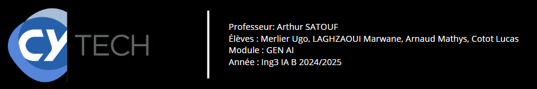
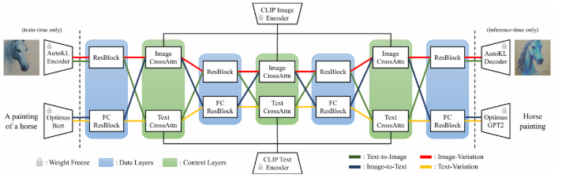
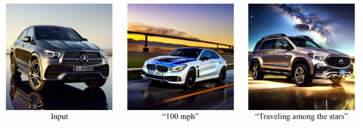
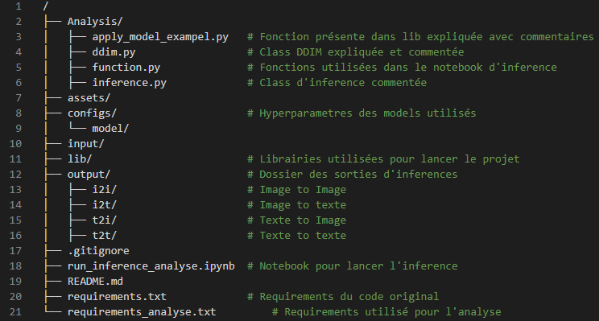
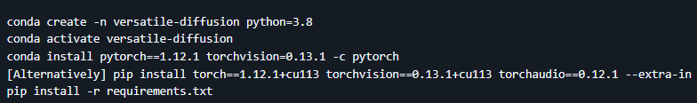

# Versatile Diffusion Model

## Introduction

L'intelligence artificielle générative a connu un essor spectaculaire ces dernières années, notamment avec les progrès réalisés dans les modèles capables de générer des images, du texte, de la musique et d'autres types de contenus à partir de données d'entrée. Parmi ces modèles, les modèles de diffusion ont émergé comme l'une des approches les plus prometteuses pour la génération de contenu visuel. Ces modèles ont prouvé leur efficacité dans la création d'images réalistes à partir de bruit aléatoire en inversant progressivement un processus de diffusion. Cela permet de générer des images de haute qualité à partir de descriptions textuelles ou de bruit aléatoire.
Les modèles de diffusion classiques, tels que Stable Diffusion ou DALL-E, sont principalement spécialisés dans une tâche donnée, soit la génération d'images à partir de texte ou la création d'images réalistes à partir de bruit. Cependant, ces modèles, bien que puissants, sont souvent limités dans leur capacité à traiter plusieurs modalités de manière fluide. Cela signifie qu'ils ne peuvent pas simultanément gérer plusieurs types de données, comme des images et des textes, dans une approche flexible. C'est ici qu'intervient le modèle Versatile Diffusion (VD), qui propose une approche intégrée et flexible pour gérer à la fois des images et du texte dans un seul modèle.

  

  Figure 1 Schéma du modèle versatile utilisé dans la revue

 

## Une approche unifiée pour le texte et l'image

Le modèle Versatile Diffusion représente une avancée significative par rapport aux modèles de diffusion traditionnels en ce qu'il est capable de gérer des tâches multimodales de manière fluide. Contrairement aux modèles de diffusion classiques, qui se concentrent généralement sur une seule modalité, VD permet de traiter à la fois des images et des descriptions textuelles au sein d'un même modèle. Cela signifie qu'il est capable de générer des images à partir de descriptions textuelles, mais aussi de générer des légendes ou des descriptions à partir d'images. De plus, il permet des modifications d'images basées sur des instructions textuelles, offrant ainsi une grande flexibilité et de nouvelles possibilités pour l'interaction avec des contenus multimodaux.
Une caractéristique clé de Versatile Diffusion est sa capacité à effectuer une diffusion flexible dans plusieurs directions, que ce soit pour générer du texte à partir d'images, des images à partir de texte ou encore des variations d'images selon des spécifications textuelles. Cela permet d'exploiter les relations entre le texte et l'image d'une manière plus fluide et plus cohérente que les modèles traditionnels, qui traitent souvent ces deux types de données de manière séparée.

  

  Figure 2 Exemple de resultats "image to image"

 

## Objectif

Dans le cadre de ce projet, nous allons implémenter le modèle Versatile Diffusion et l'évaluer. L'objectif principal est d’analyser ses capacités à traiter des tâches multimodales en générant des images à partir de texte, en générant du texte à partir d'images et en modifiant des images sur la base de descriptions textuelles.
Nous évaluerons également la flexibilité du modèle, notamment sa capacité à générer des variations d'images à partir de descriptions textuelles et à séparer le style du contenu. En outre, nous explorerons les applications pratiques du modèle, telles que la génération de contenu créatif, la recherche visuelle ou la création automatique de légendes pour des images.

 

## Références

Xu, Xingqian, et al. "Versatile Diffusion: Text, Images and Variations All in One Diffusion Model." arXiv, 2022, arxiv.org/abs/2211.08332.

# Comment run notre projet ?

## Construction du projet

Nous avons construit notre analyse autour du code déjà existant. Le dossier lib contenant toutes les fonctions nécessaires pour faire tourner le projet est resté intacte. Néanmoins, nous avons ajouté dans le dossier Analyse toutes les fonctions à expliquer tout particulièrement pour comprendre le fonctionnement d'un modèle de Diffusion Versatile. Il est donc possible de lancer les testes d'inférence depuis le notebook "run_inference_analyse.ipynb". Les résultats seront stockés dans output en fonction du type d'inférence. Nous avons décidé de ne pas garder l'interface graphique web comme à l'origine. En effet, nous avons préféré rester dans le code afin de bien appréhender le fonctionnement du modèle.

 

  

  Figure 3 Chemins de notre projet

 

## Setup

Afin de lancer notre projet vous devez vous munir de conda afin de créer un environement virtuel python. Il est également possible via python si il est à la bonne version (3.8). Ensuite il faut télécharger le "requirements_analyse.txt" afin d'aavoir les librairies du projet initiale et de notre analyse. 

 

  

  Figure 4 Lignes de commande pour lancer le projet

 

Enfin il faut télécharger les modèles sur le site Huggingface au lien suivant : 
<a href="https://huggingface.co/shi-labs/versatile-diffusion/tree/main/pretrained_pth" target="_blank">Link</a>

 

  

  Figure 5 Modèles à installer dans le dossier "pretrained"

 

Vous etes enfin pret à lancer le projet ! Il vous suffi d'ouvrir le notebook "run_inference_analyse.ipynb" afin d'utiliser le model de Diffusion Versatile et d'ouvrir le dossier Analysis afin de voir les commentaires fait sur le code !

Bonne analyse !

